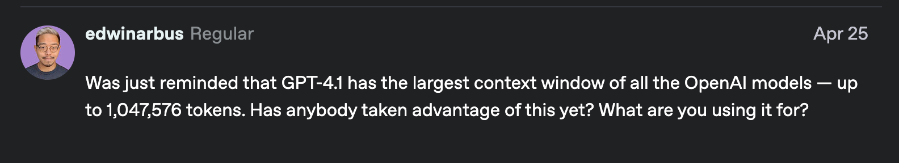

# the LLM model doesnt inheritedly have something called context you need to give it the data 

## so thats why every llm model has a different context 

the GPT-5 nano has a context window of 

it is the cheapest model 
so when we are doing like content stuff like the previous stuff the thing gets cached 

Blogs and Projects

try (we are orchestrating the AI) multi modal thinking like gemini will be doing the validating and openAI will be be doing 
the thinking

-anyalyse GEMINI 
-thinking OPENAI
-validting Another AI model 

mix the persona based based prompting with the Chain of though prompting 

